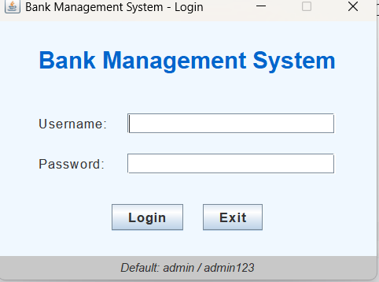
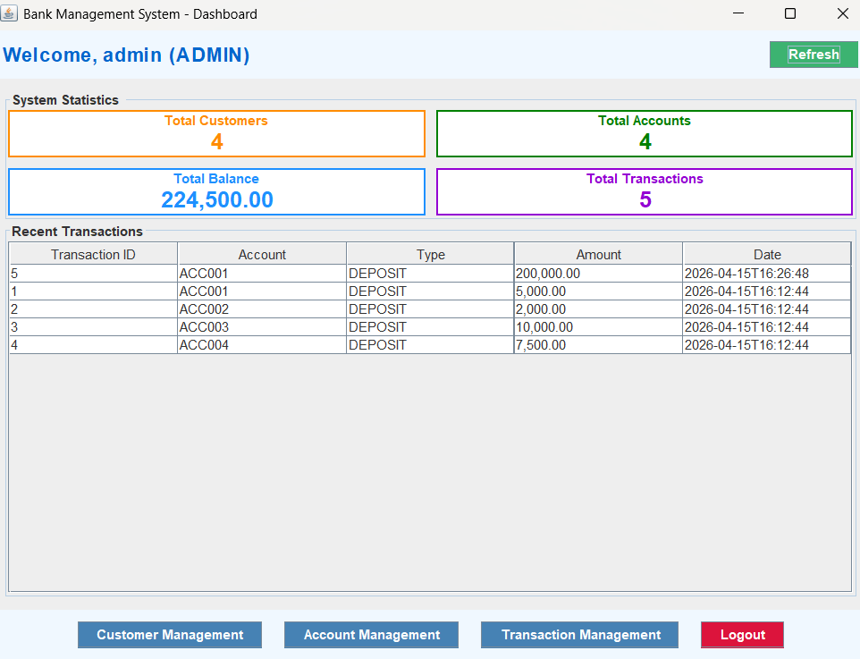
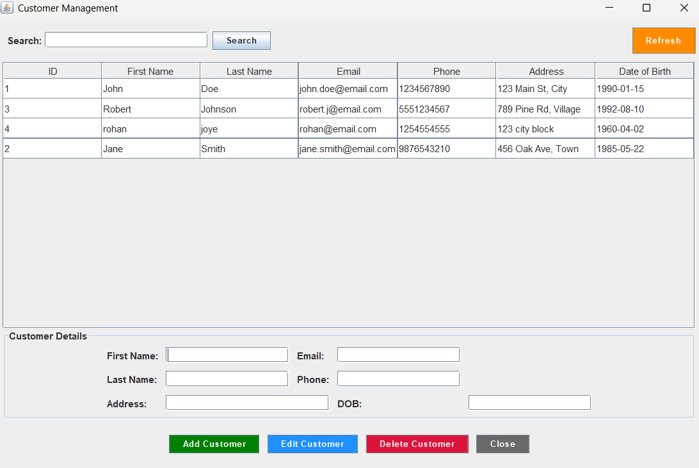
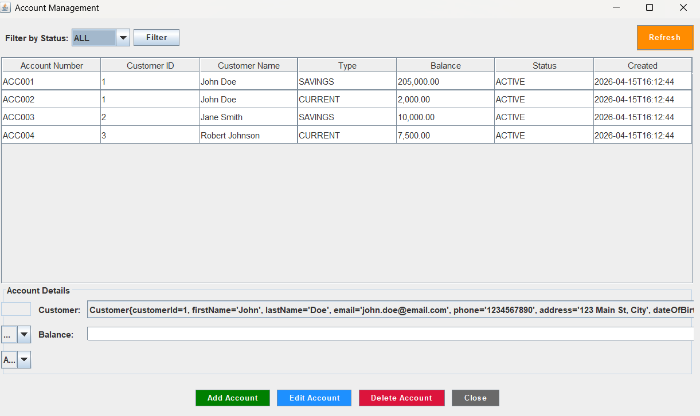

# Bank Management System

A comprehensive Java Swing-based Bank Management System with MySQL database connectivity.

## Features

- **User Authentication**: Secure login system with role-based access
- **Customer Management**: Add, edit, delete, and search customers
- **Account Management**: Create and manage customer accounts (Savings, Current, Fixed)
- **Transaction Management**: Process deposits, withdrawals, and transfers
- **Dashboard**: Real-time statistics and recent transactions overview
- **Database Integration**: Full MySQL database connectivity with DAO pattern

## System Requirements

- Java 11 or higher
- MySQL 8.0 or higher
- Maven 3.6 or higher (for building)

## Database Setup

1. Install MySQL Server on your system
2. Create a database and run the provided schema:

```sql
-- Execute the database_schema.sql file in MySQL
SOURCE database_schema.sql;
```

Or run it directly:
```bash
mysql -u root -p < database_schema.sql
```

## Database Configuration

Update the database connection settings in `src/main/java/com/bank/util/DatabaseConnection.java`:

```java
private static final String URL = "jdbc:mysql://localhost:3306/bank_management_system";
private static final String USERNAME = "root";
private static final String PASSWORD = ""; // Set your MySQL password
```

## Building and Running

### Using Maven

1. Navigate to the project directory:
```bash
cd bank-management-system
```

2. Build the project:
```bash
mvn clean package
```

3. Run the application:
```bash
java -jar target/bank-management-system-executable.jar
```

### Using IDE (Eclipse/IntelliJ)

1. Import the project as a Maven project
2. Add the MySQL connector dependency (Maven will handle this automatically)
3. Run the `LoginWindow.java` class

## Default Login

- **Username**: admin
- **Password**: admin123

## Project Structure

```
bank-management-system/
|-- src/main/java/com/bank/
|   |-- model/           # Data model classes (Customer, Account, Transaction)
|   |-- dao/             # Data Access Objects for database operations
|   |-- ui/              # Swing GUI components
|   |-- util/            # Utility classes (DatabaseConnection)
|-- pom.xml              # Maven configuration
|-- database_schema.sql  # Database schema and sample data
|-- README.md            # This file
```

## Usage Guide

### 1. Login
- Start the application and login with default credentials
- The system will verify database connection on startup

### 2. Dashboard
- View system statistics (total customers, accounts, balance, transactions)
- See recent transactions
- Navigate to management modules

### 3. Customer Management
- Add new customers with personal details
- Edit existing customer information
- Delete customers (cascades to accounts and transactions)
- Search customers by name or email

### 4. Account Management
- Create new accounts for customers
- Manage account types: Savings, Current, Fixed
- Update account status and balance
- Filter accounts by status

### 5. Transaction Management
- Process deposits and withdrawals
- Transfer funds between accounts
- View transaction history
- Real-time balance updates

## Database Schema

### Tables:
- **customers**: Stores customer information
- **accounts**: Stores account details and balances
- **transactions**: Records all financial transactions
- **users**: Stores user authentication data

### Relationships:
- Customers can have multiple accounts
- Each account belongs to one customer
- Transactions are linked to accounts

## Security Features

- Password-based authentication
- Role-based access control (Admin/Employee)
- Input validation for all forms
- SQL injection prevention through prepared statements

## Error Handling

- Comprehensive error messages for user feedback
- Database connection validation
- Transaction rollback on failures
- Input validation and sanitization

## Troubleshooting

### Common Issues:

1. **Database Connection Failed**
   - Check MySQL server is running
   - Verify database credentials in DatabaseConnection.java
   - Ensure database schema is imported

2. **ClassNotFoundException: com.mysql.cj.jdbc.Driver**
   - Ensure MySQL connector dependency is properly configured
   - Rebuild the project with Maven

3. **Login Failed**
   - Verify default user exists in database
   - Check password in users table

### Debug Mode:
Enable debug output by checking console logs during startup.

## Screenshots

### Login Window


### Dashboard


### Customer Management


### Account Management


## Development

### Adding New Features:
1. Create/update model classes in `model/` package
2. Implement DAO methods in `dao/` package
3. Create UI components in `ui/` package
4. Follow existing naming conventions and patterns

### Database Changes:
1. Update `database_schema.sql`
2. Modify corresponding model classes
3. Update DAO methods
4. Test with sample data

## License

This project is for educational purposes. Feel free to modify and distribute.

## Support

For issues and questions, please check the troubleshooting section or verify your database configuration.
